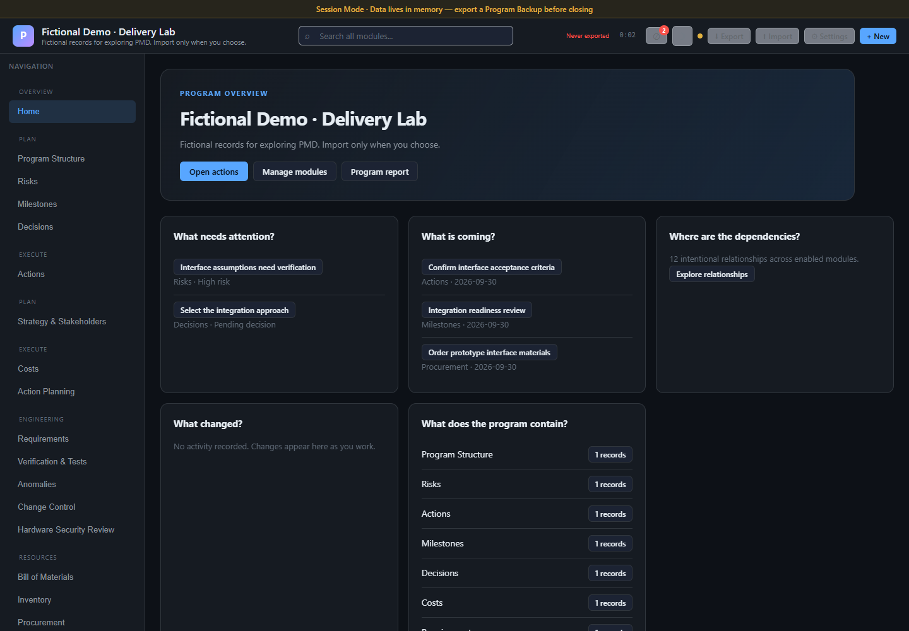
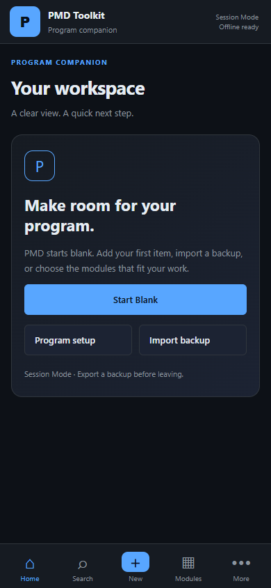
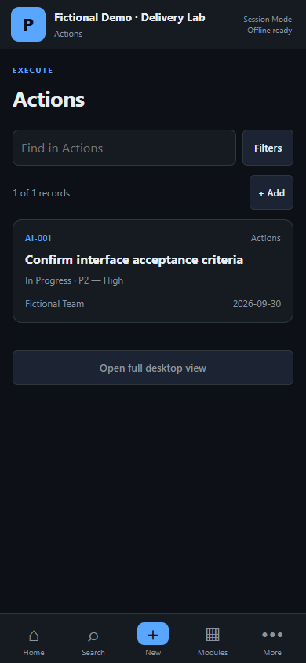
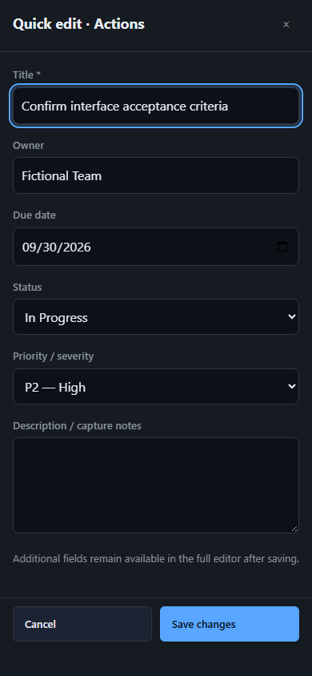

# PMD Toolkit

A blank, configurable program-management and engineering execution toolkit. Bring your own program—not someone else's example data.

**Desktop is the full workstation. Phone is the program companion.** The same application and data model serve both, with no account, backend, telemetry or required production dependencies.



## Start with your program

PMD opens blank on a fresh installation. **Start Blank** requires no setup. Configure names, terminology, modules, dropdowns, workflow meanings, risk scales, currency and reporting as needed. General, software, hardware, integration and product presets configure the toolkit; they do not insert records.

Track actions, risks, milestones, decisions, structure, costs, procurement, inventory and engineering records. Enable optional requirements, verification, change control, EVM, trade studies and hardware/software review when useful. Disable a module without deleting its data. Intentional relationships connect records across modules.

Global search, owner views, filtering, reports, audit history, undo/redo and complete JSON backups support everyday work. Missing data is not a program-health judgment.

## Useful on a phone

  

Use **Home · Search · New · Modules · More** to review attention items, find records, follow links, capture work and update routine fields. Record lists become compact cards; details and filters become sheets. Quick edits preserve fields outside the form. Large matrices, bulk operations, deep BOM editing and complex analyses remain desktop-oriented.

See the [phone guide](docs/mobile.md) and [configuration guide](docs/configuration.md).

## Data stays with you

- **Session Mode — default:** program data stays in memory. Explicitly export/import JSON. Closing or losing the session can discard work.
- **Trusted Device Mode — optional:** explicitly enable local IndexedDB saving on a trusted browser/device. See a pending/saving/saved/error state; recover a prior save or disable and clear saved copies. Browser/OS clearing and termination remain possible.
- **Program Backup:** preserves configuration, modules, records, relationships, counters and retained audit information. Keep independent backups even with device saving enabled. Share Backup uses native file sharing when available, otherwise download.
- **No sync:** desktop and phone do not automatically exchange data. Transfer a backup deliberately.

GitHub Pages serves public application files. PMD does not upload your entered or imported program data to GitHub or another service. The offline cache stores the application shell, not exports or third-party sites. Opening an external link contacts that site; exporting/sharing goes to your chosen destination.

You are responsible for deciding whether your organization's data is permitted on the device/browser you use. PMD does not encrypt program storage or backups and claims no certification, security approval or compliance status. Read [data and security guidance](docs/data-and-security.md).

## Open and install

The intended project URL is **[senseikirb.github.io/PMD-Toolkit](https://senseikirb.github.io/PMD-Toolkit/)**, after the review branch is merged and GitHub Pages is enabled.

On iPhone, open the hosted app in Safari, use **Share → Add to Home Screen**, and open the icon once while connected until the status says **Offline ready**. Safari and installed apps may have separate storage. Import your backup in the app you intend to use.

The installed application shell can reopen offline after successful caching. Session Mode is still temporary; offline availability does not retain your program. Updates are offered without an automatic reload. Confirm your backup before applying an update. Trusted Device Mode finishes a save first, and another open PMD window blocks activation.

For local use, download the complete repository and open `index.html` beside its assets. Session Mode works through `file://`; PWA installation and device saving need HTTPS or localhost.

## Explore deliberately

The [fictional demo backup](demo/fictional-program.json) is separate from startup. Download it and use **Import Program Backup** to review the import before replacement. Its program, people, dates, amounts and records are fictional. Return to a blank workspace through **Settings → Help & tools → New blank program** after backing up anything you want to retain.

Do not commit real program exports to this public repository.

## Deploy or contribute

This is a no-build static site. After PR review and merge, configure **Settings → Pages → Deploy from a branch → main → / (root)**. No secrets or application environment variables are needed.

```sh
npm install                  # development/test tools only
npx playwright install chromium
npm start                    # http://127.0.0.1:4173/PMD-Toolkit/
npm test
```

See [development and deployment](docs/development.md), [migration from V10.0](docs/migration.md), [test results](docs/validation.md), [known limitations](docs/limitations.md) and the [changelog](CHANGELOG.md).

Modern Chromium browsers are exercised by automation. Current Safari/iOS is an intended target; physical Add to Home Screen, VoiceOver, virtual keyboard, operating-system eviction and native share-sheet behavior remain device-verification items. No claim of exhaustive browser compatibility is made.

## License decision pending

The repository owner has not selected an open-source license. Public visibility does not represent a license choice. No license file has been added.
